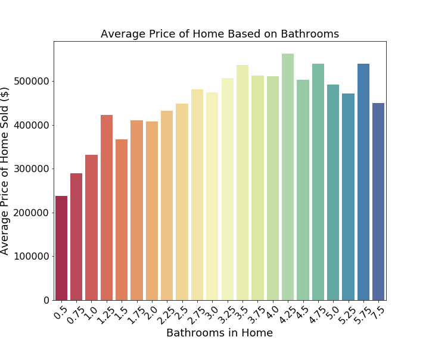
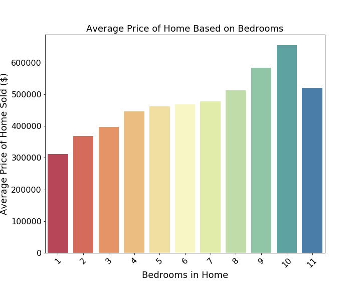
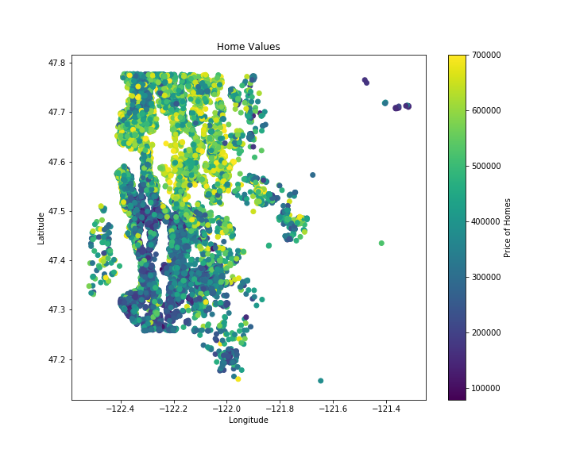
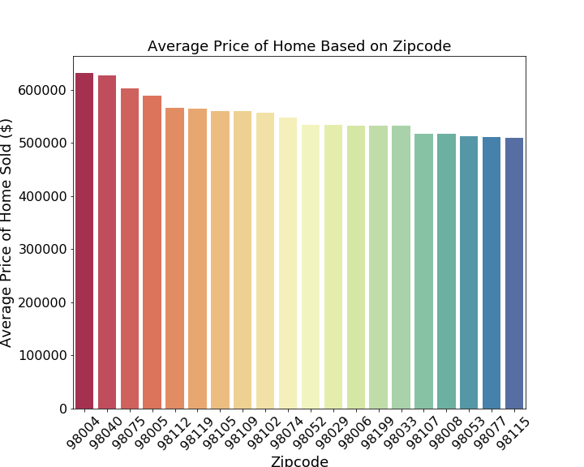
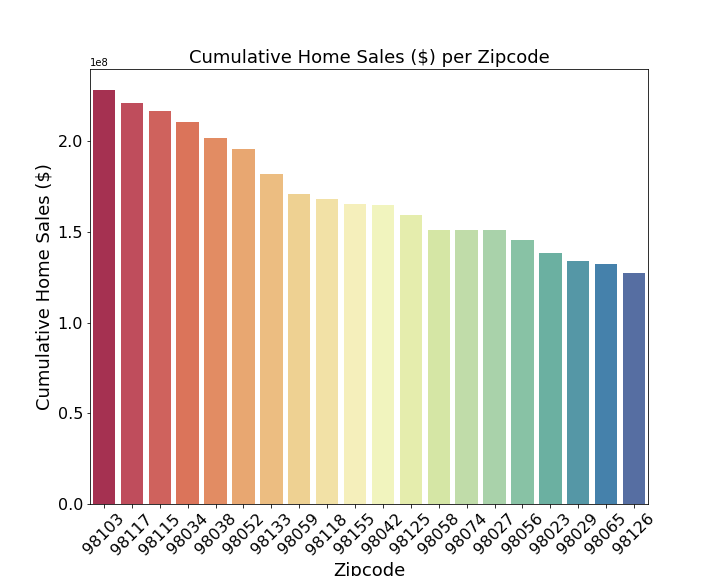
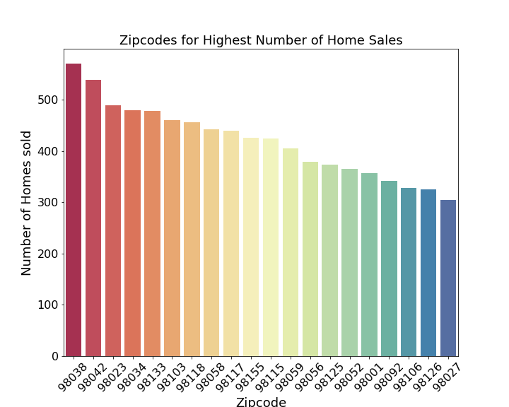

## Objective:

Import, clean, visualize and create a multivariate linear regression model that will accurately predict home sale prices in King County Washington. analyze [King County Housing data](kc_house_data.csv),

## The dataset 

The [King County Housing data](kc_house_data.csv) is a modified data set originating from [kaggle.com](https://www.kaggle.com/harlfoxem/housesalesprediction). The dataset contains a number of features which describe each home sold, such as the number of bedrooms, bathrooms and floors, or square footage of the home, the lot, and the basement. Total, there are 21 features to describe each home, and over 20K homes listed. Descriptions of each feature can be found [here.](column_names.md)

## Data Analysis

## Deliverables:

[Jupyter_Notebook](ModuleOneProject.ipynb)

[Summary_Slides](presentation.key)

[Blog_Post](https://medium.com/@stacyshingleton/king-county-house-sales-a524bc0e5cf)